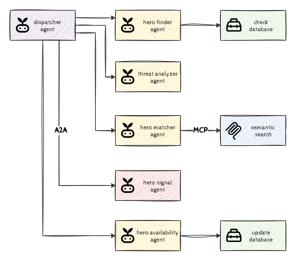

# Introduction to Agents with ADK

## Introduction

Welcome to Luminaverse! In this universe we have a new generation of super-heroes and they're a bit overwhelmed by the amount of information they need to go through to help the citizens of the world. The information flood comes from different intelligence organizations, news reports, social media chatter, and direct alerts from allies. It's impossible for a human, or even a super-hero, to monitor everything 24/7. They need a system that can not only spot a crisis but also understand its context to avoid sending the wrong hero (or any hero at all) to a false alarm.

So our objective is to build an intelligent filter for global alerts, helping our super heroes to decide whom to send for which threats and we'll use AI Agents for this purpose.



In this hack we’ll use the Agent Development Kit (ADK) framework to develop a basic agentic AI solution. ADK provides a comprehensive framework and set of tools designed to streamline the creation, deployment, and management of intelligent agents.

But let's first start with some background information about our super-heroes.

### Luminaverse Heroes

In our universe the heroes are more international than ever, see below for an overview of who we've got.

#### 晴香 (Dr. Haruka)

Our first super hero 晴香 is the visionary strategist, the primary tech provider, and reluctant (but effective) field leader. Provides computational power and ingenuity. She's got a quantum-forged exosuit: a dynamic, self-assembling, and self-repairing exoskeleton powered by a stabilized miniature Aethel-core. Can configure (stealth, heavy armor), deploy energy weapons, projected shields, or limited hard-light constructs.

#### سارة (Goddess Sara)

Next, we've got a demi-goddess, سارة, she's the heavy hitter, and has superhuman strength, durability, and virtually limitless stamina. Their unique physiology allows them to absorb and redirect vast amounts of energy.

#### Αλκμήνη (Alkmini)

Αλκμήνη is the mystic specialist of the group, she's the scout for hidden realities, and the one who understands the most esoteric threats. She has Aethel-Weaving (reality bending) capabilities and she can manipulate the raw 'Aethel' energy underlying reality (shifting gravity, manipulating light/sound, force fields, energy blasts).

#### Ծովինար (Captain Tsovinar)

The leader of the group, Ծովինար, is the moral beacon, a master tactician and a close-combat powerhouse. She has enhanced strength, speed, stamina, and healing factor far beyond peak human levels. Acute senses and a mind designed for tactical warfare and leadership makes her the ultimate leader.

#### Кассиопея (Kassiopeya)

Кассиопея is the infiltrator, the intelligence gatherer, the close-quarters combat expert, and the grounded human perspective of the team. She has peak human conditioning & artificial adaptability as the result of years of rigorous training granting her superhuman agility, reflexes, strength, and endurance. She's also the master of dozens of martial arts and weapon proficiencies.

#### თამარი (Giant Tamar)

Our last super hero თამარი is the overwhelming force, the blunt instrument, and a constant ethical dilemma for the team concerning her destructive power. Due to her mutation she can transform into a towering, massively muscled creature of immense raw power under extreme stress or threat. In her transformed state, she's nearly invincible, she possesses incredible durability, shrugging off most conventional attacks, and has an accelerated healing factor.

## Learning Objectives

This hack will help you explore the following tasks:

- Using LLM Agents to analyze unstructured data
- Augmenting Agents with Tools to expand their capabilities
- Using multiple agents for collaboration
- A bit of prompt engineering
- Model Context Protocol (MCP) as the abstraction layer for 3rd party tools
- Agent2Agent (A2A) Protocol for using 3rd party remote agents

## Challenges

- Challenge 1: First Contact
- Challenge 2: The Hero Toolkit
- Challenge 3: Agent's Logbook
- Challenge 4: Teamwork
- Challenge 5: MCP as the Matchmaker
- Challenge 6: A2A: Signal Received
- Challenge 7: Acting Agents

## Prerequisites

- Basic knowledge of GCP
- Basic knowledge of Python
- Access to a GCP environment

> [!NOTE]  
> In principle you could do the challenges in any environment, but we recommend Cloud Shell as it comes with most of the required tooling.

## Contributors

- Murat Eken

## Challenge 1: First Contact

### Introduction

We’re taking baby steps, let’s get started with our development environment. This challenge is all about getting the quintessential *Agent* to work so that we can start building it further.

> [!NOTE]  
> You could run this (and the remaining challenges) from any VM, but we recommend you to use Cloud Shell as it comes with most of the prerequisites pre-installed.

### Description

We’ve already prepared a code base for you and put it in a Git repository (your coach will provide you the link). Clone that on Cloud Shell, create a virtual environment and install the requirements.

Once everything is set up, run `adk web` and make sure that the agent responds back.

### Success Criteria

- The Git repository has been cloned to Cloud Shell.
- You get no errors when you greet the agent from the `adk web` UI.
- No code was modified.

### Learning Resources

- [Cloud Shell](https://cloud.google.com/shell/docs/launching-cloud-shell)
- [Cloud Shell Editor](https://cloud.google.com/shell/docs/launching-cloud-shell-editor)
- [Previewing web apps](https://cloud.google.com/shell/docs/using-web-preview)

### Tips

- [Setting up authentication for ADK](https://google.github.io/adk-docs/get-started/quickstart/#set-up-the-model)

## Challenge 2: The Hero Toolkit

### Introduction

We have our first agent, and if you'd now ask which super hero to pick for an alert, the LLM would gladly make some suggestions. But since it doesn't know about our Luminaverse, it would probably take the well-known heroes, or fabricate imaginary ones. This is because LLMs lack real-time and specific information (think about your internal documents/databases/processes/rules, LLMs have no access to that information).

This is where *Tools* come into the picture: they provide a way for LLMs/agents to access external systems, databases, or APIs, thereby augmenting the LLM's knowledge base and enabling it to perform more complex, data-dependent operations. Although in this challenge we'll use a tool to gather additional information, tools can also be used to execute actions such as creating tickets, modifying local files, updating databases, generating media, sending communications etc.

> [!NOTE]  
> This might not be too obvious as we're keeping it simple in this hack, but keep in mind that LLMs are flexible enough to call the appropriate tools even when you ask them questions that might not be directly related to the tool. For example, imagine an Agent with a tool for looking up weather information, you could ask the Agent what to wear, and the Agent would use the tool to check the weather conditions to find the right outfit.

### Description

The provided code base already has a function that can look up our Luminaverse heroes (and their availability) in `tools.py`. Update the `hero_finder_agent` to use that function as a tool. Once everything works as expected, push the changes to the repository.

> [!NOTE]  
> Typically we’d use a proper database or an external API to do the lookup, but for the sake of simplicity, the lookup tool for this challenge will be using a local `sqlite` database.

### Success Criteria

- The Agent has been configured to use the `get_available_heroes` function as a tool.
- The Agent suggests the heroes `Αλκμήνη, Ծովինար, Кассиопея, თამარი` from the Luminaverse for the following alert:

  ```text
  URGENT - Tokyo.
  The Shibuya Crossing has gone dark. 
  All electronic billboards and screens have been hijacked, displaying a single, cryptic symbol.
  Reports indicate that augmented reality overlays are malfunctioning city-wide, projecting 
  hostile, glitching apparitions into the real world.
  ```

- The changes have been pushed to the remote Git repository.

### Learning Resources

- [Tools in ADK](https://google.github.io/adk-docs/tools/)

### Tips

- Cloud Shell has a CLI client for `sqlite3` databases, which you can use to explore the contents of the provided `sqlite` database.

## Challenge 3: Agent's Logbook

### Introduction

Meaningful, multi-turn conversations require agents to understand context. Just like humans, they need to recall the conversation history: what's been said and done to maintain continuity and avoid repetition. The Agent Development Kit (ADK) provides structured ways to manage this context through *Session*, *State*, and *(Long Term) Memory*.

In this challenge we'll focus on the session state. Within each `Session` (our conversation thread), the `state` attribute acts like the agent's dedicated scratchpad for that specific interaction. While session events hold the full history, session state is where the agent stores and updates dynamic details needed during the conversation.

### Description

Modify the `hero_finder_agent` to save the list of heroes in the session state. This list should be a comma-separated string stored in the session state under the name `available_heroes`.

### Success Criteria

- The Agent has been configured to store the list of available agents in the session state.
- The session state contains `Αλκμήνη, Ծովինար, Кассиопея, თამარი` after responding to the following alert:

  ```text
  WARNING - New York City.
  Grand Central Station is frozen in time.
  Witnesses report a "golden shimmer" that swept through the terminal, 
  and now thousands of people are motionless statues.
  A single, cloaked figure is seen moving among them.
  ```

- The changes have been pushed to the remote Git repository.

### Learning Resources

- [Session state in ADK](https://google.github.io/adk-docs/sessions/state/)

### Tips

- You can use `adk web` UI to inspect the session state (and to verify that everything works as expected).

## Challenge 4: Teamwork

### Introduction

Breaking down complex problems into smaller, manageable sub-problems is a well-established strategy in software development. Multi-agent systems apply this principle to AI, allowing specialized agents to handle specific aspects of a larger task.

In this challenge we'll introduce the concept of *sub-agents* and *workflow agents* which are specialized agents that control the execution flow of its sub-agents.

> [!NOTE]  
> Workflow agents (sequential, parallel, loop) can be useful for orchestration in many cases as they're reliable, well structured and predictable. However, it's also possible to use LLM based Agents for orchestration if more flexibility is needed. In that case you'll be defining the order and conditions for running the sub-agents in the agent's instructions (the prompt).

### Description

Create two new agents, a `threat_analysis_agent` which, given the alert message, classifies the alert into one of `MYSTICAL`, `TECHNOLOGICAL`, `CRIMINAL` threat types, and stores that into the session store as `threat_type`. And a new sequential agent `dispatcher_agent` that calls the `hero_finder_agent` and the `threat_analysis_agent` in sequence. Once you have created the new agents, update the `root_agent` to be the `dispatcher_agent`.

### Success Criteria

- The Agent runs both `hero_finder_agent` and `threat_analysis_agent` in sequence and updates the session store.
- The session state contains `Αλκμήνη, Ծովինար, Кассиопея, თამარი` for `available_heroes` and `TECHNOLOGICAL` for `threat_type` after responding to the following alert:
  
  ```text
  ALERT - Istanbul.
  The waters of the Bosphorus are receding at an unnatural rate.
  Fishermen and ferries report automatons rising from the exposed seabed along the strait.
  They are marching towards the historic peninsula, ignoring all attempts at communication.
  The Grand Bazaar has been evacuated.
  ```
  
- The changes have been pushed to the remote Git repository.

### Learning Resources

- [Multi-Agent Systems in ADK](https://google.github.io/adk-docs/agents/multi-agents/)

### Tips

- You can use `adk web` UI to view the agents involved.

## Challenge 5: MCP as the Matchmaker

### Introduction

We have built and referenced our own tool in the second challenge, but what about using tools developed by others? This is where the Model Context Protocol (MCP) plays a role; it offers a standardized method for agents to comprehend and engage with the functionalities of external tools and services developed by others. This is vital as it empowers agents to expand their capabilities by using other pre-packaged tools.

There's a plethora of various MCP Tool providers (for example see this [list](https://mcpservers.org/)), which can run locally as well as remotely. For this challenge we'll use a sample tool that we have developed for this hack using [FastMCP](https://gofastmcp.com/getting-started/welcome) library and running remotely on [Cloud Run](https://cloud.google.com/run/docs/host-mcp-servers).

### Description

We have already provided an `mcp-server` on Cloud Run. It provides a single tool that's basically responsible for doing a semantic search to match which hero should be assigned given the threat type.

Create a new agent `hero_matcher_agent`, configure it to use the tool from that server, passing the `available_agents` and `threat_type` as arguments. Make sure that the response of this agent is stored in the session state as `chosen_hero`. Update the `dispatcher_agent` to call this agent as the last one in the sequence.

> [!NOTE]  
> In this challenge we're using a tool to do basic matching, but keep in mind that these can also be used to execute actions such as creating tickets, updating databases, sending communications etc.

### Success Criteria

- The Agent runs `hero_finder_agent`, `threat_analysis_agent`, `hero_matcher_agent` in sequence and returns the most appropriate hero.
- For example for the following alert message we expect hero `Αλκμήνη` to be put in the session state as `chosen_hero`:

  ```text
  URGENT - London. 
  Reports from Scotland Yard confirm that the Tower of London has been breached. 
  Witnesses describe ancient stone guardians coming to life and sealing the exits. 
  Strange, glowing symbols are appearing on the walls. Standard police units are ineffective.
  ```

- The changes have been pushed to the remote Git repository.

### Learning Resources

- [MCP Tools in ADK](https://google.github.io/adk-docs/tools/mcp-tools/)

### Tips

- You can use a [proxy](https://cloud.google.com/sdk/gcloud/reference/run/services/proxy) to simplify the authentication for the Cloud Run service.

## Challenge 6: A2A: Signal Received

### Introduction

In the previous challenge we've learned that we can use tools developed by others, but what about agents? This is where Agent2Agent comes in, it provides a standard way for discovering and utilizing agents developed by others.

### Description

We have already provided an `a2a-server` on Cloud Run. It has a single agent deployed that can signal the hero using whatever method they prefer (lights, smoke, fax, email, carrier pigeon etc).

Create a new agent `signal_hero_agent` that uses A2A protocol to connect to the remote `a2a-server` and add it to the `dispatcher_agent` sequence as the last one.

### Success Criteria

- The Agent runs all the agents in sequence and signals the chosen hero for the following alert message:

  ```text
  RED ALERT - Amsterdam.
  The Rijksmuseum has been breached, but no alarms were triggered.
  "The Night Watch" has been stolen. In its place, a single black feather was left on the gallery floor.
  Interpol confirms this is the calling card of "Nyx", a notorious international art thief.
  ```

- The changes have been pushed to the remote Git repository.

### Learning Resources

- [Using A2A Agents in ADK](https://google.github.io/adk-docs/a2a/quickstart-consuming/)

### Tips

- You can use `adk web` UI to view the agents involved.
- You can use a [proxy](https://cloud.google.com/sdk/gcloud/reference/run/services/proxy) to simplify the authentication for the Cloud Run service.
- For this challenge if you're using the Cloud Run proxy, you need to stick to port `8080`.

## Challenge 7: Acting Agents

### Introduction

The agent's abilities have so far been mostly limited to data retrieval and analysis; there's no transaction, no update, no *ACT*ion. Agents in general will take action, beyond *retrieving data from other systems* to provide much better value to the user. You should think of agents that *do things* such as sending emails, updating CRMs, placing work orders, approving requests, and so on. Although in the previous challenge we've already dealt with an agent that does something (sending a signal), we're going to create a more concrete example in this challenge.

### Description

Create a new agent `update_availability_agent` that uses a tool to update the availability information of the chosen hero in the database and add it to the `dispatcher_agent` sequence as the last one.

### Success Criteria

- The Agent runs all the agents in sequence and updates the availability of the chosen hero as the last step.
- For the following alert we expect the availability of the chosen hero (one of `Ծովինար, Кассиопея, თამარი`) to be updated:

  ```text
  URGENT - Hong Kong.
  Multiple shipping containers at the Port of Hong Kong have been inexplicably crushed 
  and their contents vanished, despite no signs of forced entry.
  A new Triad leader, calling himself "The Iron Hand," is responsible. 
  He is systematically extorting shipping magnates for "protection money," threatening to 
  destroy their cargo if they don't comply. 
  ```

- The changes have been pushed to the remote Git repository.

### Tips

- Cloud Shell has a CLI client for `sqlite3` databases, which you can use to verify that everything works as expected.
