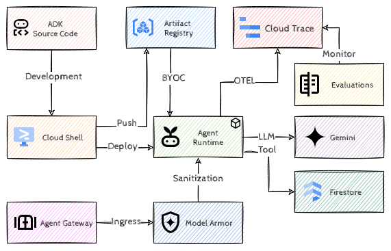

# Agents: Beyond the Basics

## Introduction

Welcome to Cymbal Retail! As a leading global e-commerce enterprise, Cymbal Retail is modernizing its customer operations with autonomous AI agents. The engineering team has built a customer support and order management agent using the Google Agent Development Kit (ADK). This agent handles real-time order inquiries, checks warehouse stock, answers store policies, and processes refunds.

While building a prototype agent locally is straightforward, running agentic workloads in an enterprise production environment introduces architectural, security, and operational questions such as:

- *How do we scale and operate the agents without managing VMs or Kubernetes clusters?*
- *How do we enforce least-privilege governance?*
- *How do we protect agents from adversarial attacks and data leaks?*
- *How do we guarantee quality and detect drift once deployed?*



In this gHack, you will take an existing, complete Python ADK agent and implement the full scale, governance, and operations lifecycle on Google Cloud's Gemini Enterprise Agent Platform.

## Learning Objectives

In this hack, you will learn how to:

1. Package a complete ADK Python agent into a custom container and deploy it to *Agent Runtime* with a custom container.
2. Optimize resource allocation for production agentic workloads.
3. Establish least-privilege security and auditability using *Agent Identity*.
4. Govern ingress traffic, and block prompt injections, jailbreaks, and sensitive data leakage by integrating *Agent Gateway* with *Model Armor*.
5. Establish continuous quality in production by configuring *Online Monitors* in Agent Platform to score live telemetry traces against multi-turn AutoRater metrics.

## Challenges

- Challenge 1: It Works on My Machine!
- Challenge 2: Contain Your Excitement
- Challenge 3: Badge, Please!
- Challenge 4: Bouncer at the Gate
- Challenge 5: Keeping It Real (Time)

## Prerequisites

- Familiarity with Google Cloud Console and Cloud Shell.
- Understanding of basic container concepts (Docker, Artifact Registry).
- Basic understanding of Python and AI Agents (ADK concepts).
- A Google Cloud project with `Owner` or `Editor` + IAM Admin permissions.

> [!NOTE]
> All challenges can be completed in Cloud Shell. No local workstation setup is required.

## Contributors

- Murat Eken

## Challenge 1: It Works on My Machine!

### Introduction

We already have a complete Python agent built with the Google Agent Development Kit (ADK). The agent includes tools for looking up customer orders (`lookup_order`), checking warehouse inventory (`check_inventory`), reviewing store policies (`search_product_faq`), and processing refunds (`process_refund`).

Before containerizing and deploying to the cloud, we'll verify that the agent behaves correctly and executes its tools in a local development environment.

### Description

The sample agent can be found [here](https://github.com/meken/gcp-agentops-demo/archive/refs/heads/main.zip), download it to your Cloud Shell. Install its dependencies in a Python virtual environment.

Set up the authentication to use Agent Platform Authentication (API keys are not allowed!). Start the database emulator using the provided `start-database-emulator.sh` script and launch the ADK web playground.

Verify that you get relevant answers when the agent is prompted with the test queries.

### Success Criteria

- Python virtual environment is created and dependencies are installed without errors.
- Authentication for Agent Platform is set up (without API keys!).
- The agent successfully answers the following test queries and executes the appropriate tool functions
  - Order lookup: *"What is the status of order ORD-1001?"*
  - Inventory check: *"How many Wireless Headphones are in stock?"*
  - Policy question: *"What is the return policy for electronics?"*
  - Refund processing: *"I want to return order ORD-1001 because the headphones were defective. Please refund $199.99."*  
- The order status for `ORD-1001` is verified as `DELIVERED`, stock for headphones is confirmed, and the refund is approved with a transaction ID.
- No code was modified.

### Learning Resources

- [Setting up authentication for ADK](https://adk.dev/agents/models/google-gemini/#google-cloud-agent-platform)
- [ADK CLI](https://adk.dev/api-reference/cli/#adk)

### Tips

- If using `adk web` in Cloud Shell, pass `--allow_origins="*"` to ensure the Cloud Shell web preview works smoothly.

## Challenge 2: Contain Your Excitement

### Introduction

Running agents locally is fine for development but enterprise workloads require high availability, auto-scaling, low latency, and robust runtime isolation.

*Agent Runtime* (part of Gemini Enterprise Agent Platform) provides a managed, serverless execution environment specifically built for AI agents. While Agent Runtime can deploy from source, enterprise platforms often require the *Bring Your Own Container (BYOC)* pattern to maintain full control over base images, security vulnerability scanning, system packages, and language runtime versions.

In this challenge, you will package the agent into a container image and deploy it to Agent Runtime.

### Description

The sample agent already contains the necessary files to build a container image. Build the container image using Google Cloud Build (or Docker) and push it to the *Artifact Registry* repository `agent-images` that's in your project.

Once the image is on Artifact Registry, deploy the containerized agent to *Agent Runtime* using the BYOC option. Make sure to use the following parameters:

- CPU: 1 vCPU
- Memory: 4 GiB
- Min instances: 1
- Max instances: 5
- Concurrency: 4 requests per instance

> [!NOTE]  
> The deployment might take ~5 minutes.

### Success Criteria

- Custom container image is built and stored in Artifact Registry.
- An Agent Runtime resource is successfully created and in ready state.
- Sizing configuration (CPU, Memory, Concurrency, Min/Max instances) is correctly applied.
- The deployed agent successfully processes remote queries and returns streaming responses using its tools
  > You can ignore any permission denied errors when the tools access the Firestore database, we'll address that in the next challenge.
- No code was modified.

### Learning Resources

- [Deploy an agent on Agent Runtime](https://docs.cloud.google.com/gemini-enterprise-agent-platform/scale/runtime/deploy-an-agent)
- [Agent Runtime BYOC Setup](https://docs.cloud.google.com/gemini-enterprise-agent-platform/build/runtime/setup#byoc)
- [Sizing and Concurrency for Agent Runtime](https://docs.cloud.google.com/gemini-enterprise-agent-platform/scale/runtime/optimize-and-scale)

## Challenge 3: Badge, Please!

### Introduction

Traditional cloud workloads often share service accounts across multiple services. If a service account is overprivileged or credentials leak, attackers can access unrelated corporate data.

*Agent Identity* solves this by providing an identity tied directly to the lifecycle of each agent. Unlike standard service accounts:

- Agent identities cannot be shared across multiple unrelated workloads.
- They cannot be impersonated from untrusted environments.
- Tokens are bound to the agent's unique cryptographic certificate via *Context-Aware Access (CAA)* and mTLS, making stolen tokens un-replayable.

In this challenge, you will govern your deployed agent by configuring its Agent Identity and granting precise, least-privilege permissions.

### Description

Enable agent identity for your agent, find its principal and grant it the permission to access the Firestore database.

> [!NOTE]  
> Run the `seed-cloud-database.sh` script before you test your agent.

### Success Criteria

- The deployed agent has an active Agent Identity configured on Agent Runtime.
- Granular IAM role bindings are attached to the agent's identity principal following the principle of least privilege.
- Verified that all tool invocations and telemetry events in Cloud Logging / Cloud Trace are attributed to the Agent Identity principal.
- No code was modified.

### Learning Resources

- [Use Agent Identity with Agent Runtime](https://docs.cloud.google.com/gemini-enterprise-agent-platform/scale/runtime/agent-identity)
- [Agent Identity Overview & SPIFFE Architecture](https://docs.cloud.google.com/gemini-enterprise-agent-platform/govern/agent-identity-overview)
- [Managing Access for Deployed Agents](https://docs.cloud.google.com/gemini-enterprise-agent-platform/scale/runtime/manage-agent-access)

## Challenge 4: Bouncer at the Gate

### Introduction

Agents connected to business systems introduce new security vectors, such as prompt injections, jailbreaks, leakage of sensitive data etc. Hardcoding defenses into every individual agent can be brittle and error-prone.

*Agent Gateway* serves as the centralized network ingress/egress control plane for Gemini Enterprise Agent Platform. Integrating *Model Armor* with Agent Gateway provides real-time, inline content inspection and filtering. Model Armor can sanitize prompts on ingress (before they reach the agent) and filters responses on egress (before they reach the client), enforcing security policies across your entire agent fleet without touching a single line of agent code.

In this challenge we'll start protecting our agent against the mentioned attack vectors.

### Description

Create a *Model Armor Template*, call it `retail-agent-security-template` and configure it with the following filters:

- *Prompt Injection & Jailbreak Filter:* Set to `BLOCK` on high confidence.
- *PII / Sensitive Data Filter:* Set to `REDACT` or `BLOCK` for Credit Cards, SSNs, and sensitive identifiers.
- *Harm & Toxicity Filter:* Block Hate Speech, Dangerous Content, and Harassment.

Create and configure an *Agent Gateway* resource for **ingress mode** and attach the Model Armor security template to the Agent Gateway.

Route traffic to your Agent Runtime instance through the governed Agent Gateway.

### Success Criteria

- Model Armor template is created with prompt injection, jailbreak, and PII protection rules.
- Agent Gateway is deployed with the Model Armor template attached.
- Verify that the setup is working by running the `sanitization` tets, they should all pass successfully.
- No code was modified.

### Learning Resources

- [Agent Gateway Overview](https://docs.cloud.google.com/gemini-enterprise-agent-platform/govern/gateways/agent-gateway-overview)
- [Configure Model Armor on Agent Gateway](https://docs.cloud.google.com/gemini-enterprise-agent-platform/govern/configure-model-armor)
- [Integrate Model Armor with Agent Gateway](https://docs.cloud.google.com/model-armor/model-armor-agent-gateway-integration)
- [Route Agent Runtime Traffic through Agent Gateway](https://docs.cloud.google.com/gemini-enterprise-agent-platform/scale/runtime/agent-gateway-runtime-deploy)

### Tips

- Model Armor and Agent Gateway must be in the same Google Cloud region.

## Challenge 5: Keeping It Real (Time)

### Introduction

Our agent is now protected against malicious vectors and hosted on a scalable infrastructre, but we're not done yet. In real world customers can phrase their requests in unexpected ways and underlying foundation models or external APIs can introduce subtle behavior changes or hallucinations.

In order to make sure that our agent keeps working properly we need to continously monitor its *behavior*. *Online Monitors* sample conversations from Cloud Trace / Cloud Logging and score them against multi-turn AutoRater metrics. This way we can proactively catch quality drift before customers are impacted.

### Description

Create a new *Online Monitor* for the agent and enable only the following metrics to track: *Final Response Quality* and *Tool Use Quality*. Set sampling percentage to `100%` and configure a sample cap of 50.

Run the `simulate-traffic.sh` script for `20` sessions and `1.0` second of delay and wait for the evaluation to be triggered. Find the metric with the lowest value and investigate its root cause. Fix that and redeploy the agent with the fix. Run the script again to verify if the impacted metric is improved.

### Success Criteria

- An Online Monitor is created and active on Agent Platform.
- The metrics *Final Response Quality* and *Tool Use Quality* are configured.
- The (subtle) issue with the agent is detected through investigation of evaluations and fixed.
- The Online Monitor metrics are above `90%` after the fix.

### Learning Resources

- [Continuous Evaluation with Online Monitors](https://docs.cloud.google.com/gemini-enterprise-agent-platform/optimize/evaluation/evaluate-online)
- [Agent Evaluation Overview](https://docs.cloud.google.com/gemini-enterprise-agent-platform/optimize/evaluation/agent-evaluation)
- [Observability & OpenTelemetry in ADK](https://docs.cloud.google.com/gemini-enterprise-agent-platform/optimize/observability/traces)
- [Multi-Turn Evaluation Metrics Reference](https://cloud.google.com/gemini-enterprise-agent-platform/optimize/evaluation/manage-metrics)

### Tips

- You can filter the telemetry using the following conditions:

  ```text
    labels."gen_ai.evaluation.name" = xxxx
    labels."gen_ai.evaluation.score.value" < 1
  ```

  And look for a rubric around `SEMANTIC_CORRECTNESS`.
