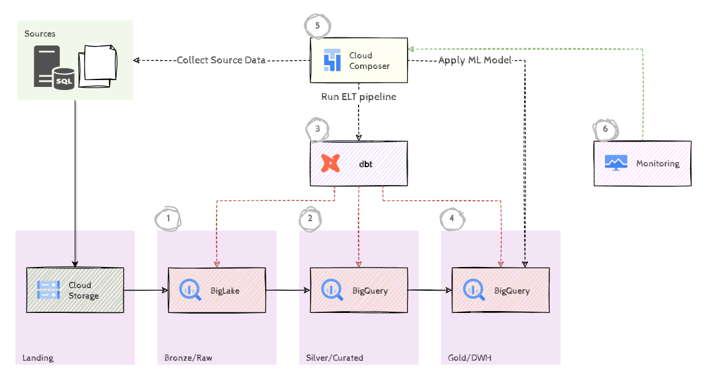

# Data Warehousing with BigQuery and DBT

## Introduction

In this hack we'll implement a classic data warehouse using modern tools, such as Cloud Storage, BigQuery, DBT and Cloud Composer. We'll start with a modified version of the well known *AdventureWorks* OLTP database (a sample database that contains sales data for a fictitious, multinational manufacturing company that sells bicycles and cycling accessories) and build a dimensional model using DBT.



In our scenario, the data has already been copied from the database to a landing bucket in Cloud Storage as CSV files. In the first challenge we'll create BigLake tables in BigQuery to make that data accessible in BigQuery. In the second challenge we'll apply some basic cleansing and transformations to load the data into staging tables. In the third challenge we're going to automate this process using DBT. The fourth challenge is all about creating the dimensional model and the fact table. In the last challenges we'll automate, orchestrate and monitor the whole process by tapping into Cloud Composer and Cloud Monitoring.

## Learning Objectives

In this hack, you will explore and learn about the following concepts:

- BigQuery as a classic Data warehouse
- BigLake for accesing data in an object store and applying table semantics
- Dataform for automating data transformation steps
- Dimensional modeling with a star schema
- Cloud Composer for orchestration
- Cloud Monitoring for monitoring and alerting

## Challenges

- Challenge 1: Loading the source data
- Challenge 2: Staging tables
- Challenge 3: DBT for automation
- Challenge 4: Dimensional modeling
- Challenge 5: Cloud Composer for orchestration
- Challenge 6: Monitoring the workflow

## Prerequisites

- Basic knowledge of GCP
- Basic knowledge of Python
- Basic knowledge of SQL
- Access to a GCP environment

## Contributors

- Murat Eken

## Challenge 1: Loading the source data

### Introduction

This first step is all about getting started with the source data. Typically data is copied periodically from operational data stores, such as OLTP databases, CRM systems etc. to an *analytics data platform*. Many different methods exist for getting that data, either through pushes (change data capture streams, files being generated and forwarded etc.), or pulls (running periodically a query on a database, copying from a file system etc). But for now we'll ignore all that and assume that somehow data has been collected from the source systems and put into a Google Cloud Storage bucket.

> [!NOTE]  
> For the sake of simplicity, we'll implement full loads. In real world applications with larger datasets you might want to consider incremental loads.

### Description

We have already copied the data from the underlying database to a specific Cloud Storage bucket. Go ahead and find that bucket, and have a look at its contents. Create a new BigQuery dataset called `raw` in the same region as that storage bucket, and create **BigLake** tables for the following entities: `person`, `sales_order_header` and `sales_order_detail`. You can ignore the other files for now. Make sure to name the *Cloud Resource* connection **conn** and to create it in the same region as the storage bucket.

### Success Criteria

- There is a new BigQuery dataset `raw` in the same region as the landing bucket.
- There is a new *Cloud Resource* connection with the id **conn** in the same region as the landing bucket.
- There are 3 BigLake tables with content in the `raw` dataset: `person`, `sales_order_header` and `sales_order_detail`.

### Learning Resources

- [Creating BigQuery datasets](https://cloud.google.com/bigquery/docs/datasets#console)
- [Introduction to BigLake tables](https://cloud.google.com/bigquery/docs/biglake-intro)
- [Creating BigLake tables](https://cloud.google.com/bigquery/docs/create-cloud-storage-table-biglake)

## Challenge 2: Staging tables

### Introduction

Before we create our dimensional model we'll first do some cleanup. There's a plethora of different approaches here, and different modeling techniques (Data Vault, normalized persistent/ephemeral staging tables etc.), but we'll keep things simple again. Our source data is already relational and has the correct structure (3NF), we'll stick to that data model and only do some minimal cleansing.

### Description

Some of the tables have duplicate records and problematic columns that we'd like to remove. Create a new BigQuery dataset called `curated` and create a new table for each BigLake table from the previous challenge. Name the new tables by prefixing them with `stg_` and remove any **duplicate** records as well as any columns with **only `null` values**. Make sure that the columns `order_date`, `due_date`, `ship_date`, `birth_date` and `date_first_purchase` have the **data type `DATE`** in the new tables.

### Success Criteria

- There is a new BigQuery dataset `curated` in the same region as the other datasets.
- There are 3 BigQuery tables with content in the `curated` dataset: `stg_person`, `stg_sales_order_header` and `stg_sales_order_detail` with no duplicate records and no columns with only `null` values.
- The columns `order_date`, `due_date`, `ship_date`, `birth_date` and `date_first_purchase` in the new tables have the data type `DATE`.

### Learning Resources

- [Creating BigQuery tables from a query result](https://cloud.google.com/bigquery/docs/tables#create_a_table_from_a_query_result)
- [BigQuery Date functions](https://cloud.google.com/bigquery/docs/reference/standard-sql/date_functions)

### Tips

- Data Profile (with 100% sampling!) can help you find `null` columns.
- [EXCEPT](https://cloud.google.com/bigquery/docs/reference/standard-sql/query-syntax#select_except) is useful when you want to discard a few columns when selecting all columns from a table.

## Challenge 3: DBT for automation

### Introduction

Although we've only dealt with 3 tables so far, our data model has many more tables, and we have to perform multiple SQL operations to process the data. Doing this manually is error-prone and labor intensive. Wouldn't it be great if we could automate this by developing and operationalizing scalable data transformation pipelines in BigQuery using SQL? Enter *DBT* 🙂

### Description

In order to connect from DBT to BigQuery we're going to use a service account. Navigate to Service Accounts page and find the `DBT Service Account`. Create a new JSON key for this service account and download it.

> [!NOTE]  
> It's not recommended to use service account key files in production, Workload Identity Federation is the preferred option, but for the sake of simplicity we'll stick to key files for this workshop.

Log in to the [Cloud DBT Console](https://emea.dbt.com) using the DBT credentials provided to you. Select the project `gHacks` and create a new *Environment*. Call the *Environment* `gHacks-playground` and set its type to `Development`. Configure a new *Connection* of type `BigQuery`, use the service account key file that you've created. Make sure to set the *Location* to the same region in which you have created your datasets in the previous challenges.

> [!NOTE]  
> The Connection configuration opens in a new tab, after you've completed the configuration, you can close that tab and the new connection should be in the drop down for your environment.

Once the new *Development Environment* is created, go to the DBT Studio, and run the model for `staging`.

TODO Development Credentials, how do you get there?

### Success Criteria

- There's a successful execution of the model for the `staging` tables.
- The following 12 tables have been created in the `curated` dataset:
  - `stg_address`
  - `stg_country_region`
  - `stg_credit_card`
  - `stg_customer`
  - `stg_order_status`
  - `stg_person`
  - `stg_product`
  - `stg_product_category`
  - `stg_product_subcategory`
  - `stg_sales_order_detail`
  - `stg_sales_order_header`
  - `stg_state_province`

### Learning Resources

TODO

## Challenge 4: Dimensional modeling

### Introduction

Dimensional modeling is a data warehousing technique that organizes data into fact tables containing measurements and dimension tables, which provide context for those measurements. This structure makes data analysis efficient and intuitive, allowing users to easily understand and query data related to specific business events.

### Description

We're going to create a **star schema** by extracting *dimension* tables and a *fact* table from the *staging* tables that have been created in the previous challenge. First you need to create another dataset and call it `dwh`.

We have already provided the code for the dimension tables, first run the pipeline for the tag `dimension` to generate the dimension tables. Then create a new `fact_sales.sql` file in the same folder as the dimension tables, configure it with the tag `fact`, `order_date` as the partition column and `product_key` as the clustering column. Include the following columns in the the fact table:

- `sales_key`  (surrogate key built out of `sales_order_id` and `sales_order_detail_id`)
- `product_key` (surrogate key built out of `product_id`, to be used for clustering)
- `customer_key` (surrogate key built out of `customer_id`)
- `credit_card_key` (surrogate key built out of `credit_card_id`)
- `ship_address_key` (surrogate key built out of `ship_to_address_id`)
- `order_status_key` (surrogate key built out of `status`)
- `order_date_key` (surrogate key built out of `order_date`)
- `order_date` (to be used for the partitioning)
- `unit_price`
- `unit_price_discount`
- `cost_of_goods_sold` (retrieved from `stg_products` table, `standard_cost` column)
- `order_quantity`
- `gross_revenue` (calculated by multiplying `unit_price` with `order_quantity`)
- `gross_profit` (calculated by subtracting discounts and costs of goods sold from `gross_revenue`)

Once the configuration is complete run the model with the tag `fact` and commit your changes.

> [!NOTE]  
> If you've created the fact table with no or a different partition column, you'll have to drop it first manually before you can run the Dataform pipeline with the `fact` tag.

### Success Criteria

- There is a new BigQuery dataset `dwh` in the same region as the other datasets.
- There's a successful execution of the model for the `dimension` and `fact` tags.
- There are dimension tables and a new partitioned and clustered fact table, `fact_sales` in the `dwh` dataset, with the columns as specified above having in total **121317** rows.

### Learning Resources

- [Creating tables with Dataform](https://cloud.google.com/dataform/docs/define-table)
- [Create table partitions and clusters with Dataform](https://cloud.google.com/dataform/docs/partitions-clusters)
- [Defining additional table configurations with Dataform](https://cloud.google.com/dataform/docs/table-settings#execute-sql-after-table)
- [Introduction to partitioned tables](https://cloud.google.com/bigquery/docs/partitioned-tables)
- [Introduction to clustered tables](https://cloud.google.com/bigquery/docs/clustered-tables)

### Tips

- Find out which staging tables have the `sales_order_id` and `sales_order_details_id` as their *id* columns. Those tables will be the basis of your fact table (and you'll need *one* more table to complete your join).
- Note that the discount column is a factor between 0 and 1 (0 being no discount and 1 being a 100% discount).

## Challenge 5: Cloud Composer for orchestration

### Introduction

Running the DBT models manually works, but it's not very practical. We'd rather automate this process and run it periodically. Although DBT provides a lot of functionality to automate and schedule running pipelines, we're going to consider a bit more flexible orchestrator that can also run additional steps that might not be part of the DBT pipelines, such as pulling data from source systems, running ML models etc.

This challenge is all about Cloud Composer, which is basically a managed and serverless version of the well-known [Apache Airflow](https://airflow.apache.org/) framework, to schedule and run our complete pipeline.

> [!NOTE]  
> There's a myriad of different orchestration services on Google Cloud, see the [documentation](https://cloud.google.com/bigquery/docs/orchestrate-workloads) for more information and guidance on which one to pick for *your* specific needs.

### Description

We've already created a *Cloud Composer* environment for you. You need to configure and run [this pre-configured DAG](https://raw.githubusercontent.com/meken/gcp-dataform-bqdwh/v2.0.0/dags/etlflow.py) (which is basically a collection of tasks organized with dependencies and relationships) on that environment. The DAG (Directed Acyclic Graph) is scheduled to run daily at midnight, pulls source data from different source systems (although in our case it's using a dummy operator to illustrate the idea), runs the DBT model to generate all of the required tables, and finally runs inferencing on the fact table (using a dummy operator).

Find the DAGs bucket for the Cloud Composer environment and copy the provided DAG into the correct location. Update the *environment variables* of the Cloud Composer environment to refer to the correct Dataform repository and use the tag `v1.0.4` as the Git reference.

> [!NOTE]  
> It might take a few minutes for the DAG to be discovered by Airflow, be patient :) Once the DAG is discovered it will be started automatically, make sure to configure the environment variables before you upload the DAG.

### Success Criteria

- There's a new DAG that's triggered every day at midnight.
- There's at least one successful run of the DAG.
- No code was modified.

### Learning Resources

- [Cloud Composer Overview](https://cloud.google.com/composer/docs/composer-3/composer-overview)
- [Cloud Composer Environment Variables](https://cloud.google.com/composer/docs/composer-3/set-environment-variables)
- [Triggering DAGs](https://cloud.google.com/composer/docs/composer-3/trigger-dags)

## Challenge 6: Monitoring the workflow

### Introduction

When we run our Cloud Composer DAG manually it's easy to see if it has failed or not, but we've configured to run it automatically every day; what if something goes wrong tomorrow or the day after? In order to make sure that things stay healthy we need to do some continous monitoring, create incidents when something goes wrong and notify the responsible people. This is where *Cloud Monitoring* comes in to the play. In this challenge we'll introduce a very basic method of monitoring failed Cloud Composer workflows using Cloud Monitoring.

### Description

Create a new *Alerting Policy* for *Failed DAG runs* that will be triggered if there's at least 1 failed DAG run for the workflow from the previous challenge, for a rolling window of `10 minutes` using `delta` function and use an *Email Notification Channel* that sends an email to your personal account(s). Configure a *Policy user label* with the key `workflow-name` and the name of the monitored workflow as the value. Set the *Policy Severity Level* to `Critical` and use some sensible values for the other fields.

Create a new `broken.csv` file with the following (idea is to have multiple `csv` files with irreconcilable schemas to cause an error):

```text
foo,bar
xx,yy
```

And upload it to the landing bucket for one of the entities (next to a `data.csv` file, do not overwrite!) and re-run the Cloud Composer DAG.

> [!NOTE]  
> If you had DAG failures in the previous challenge, the configured alert might be triggered before you re-run the DAG. Please ignore that and go ahead with uploading the broken file and re-run the DAG.

When you receive an email for the incident, follow the link to view and then `Acknowledge` it.

> [!NOTE]  
> This might take ~10 minutes as Airflow will retry the failing tasks multiple times before giving it up and mark the DAG run as *failed*.

### Success Criteria

- There's a new failed DAG run.
- There's a new Cloud Monitoring incident related to the failed DAG run, that's *Acknowledged*.
- No code was modified.

### Learning Resources

- [Using Monitoring Dashboard for Cloud Composer](https://cloud.google.com/composer/docs/composer-3/use-monitoring-dashboard)
- [Creating and managing notification channels](https://cloud.google.com/monitoring/support/notification-options)
