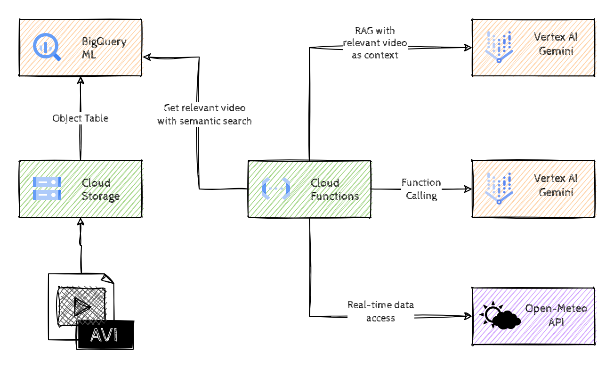

# Multimodal GenAI with RAG

## Introduction

Multimodal GenAI with RAG will help you understand how to use multimodal embeddings for semantic search and how to apply concepts such as _RAG_, _Function Calling_ to mitigate hallucinations and use up-to-date information to provide more reliable answers. 

We'll be building a weather service that can extract reliable information from recorded weather forecast videos as well as access APIs to get the most recent information.

## Learning Objectives

This hack will help you explore the following tasks:

- BigQuery Object tables
- Multimodal embeddings & Vector search in BigQuery
- Retrieval Augmented Generation (RAG)
- Function calling with LLMs

## Challenges

- Challenge 1: Loading the data
- Challenge 2: Generating multimodal embeddings
- Challenge 3: Semantic search with BigQuery
- Challenge 4: Introduction to RAG
- Challenge 5: Structured outputs

## Prerequisites

- Basic knowledge of GCP
- Basic knowledge of Python
- Basic knowledge of SQL
- Access to a GCP environment

## Contributors

- Murat Eken

## Challenge 1: Loading the data

### Introduction 

This first step is all about getting started with the source data, which is a collection of video recordings from weather forecast shows around the world.

### Description

For our system we need some sample video files. Create a new bucket, and download/copy the sample videos to the newly created bucket.

Once the data is in the bucket, create an Object table in BigQuery on that data in a new BigQuery dataset.

### Success Criteria

- There is a new Cloud Storage Bucket with the sample video files.
- There is an Object table that makes the sample video files available in BigQuery.
- No code was modified.

### Learning Resources

- [Creating new Cloud Storage Buckets](https://cloud.google.com/storage/docs/creating-buckets)
- [Object tables in BigQuery](https://cloud.google.com/bigquery/docs/object-tables)

## Challenge 2: Generating multimodal embeddings

### Introduction 

Embeddings are high-dimensional numerical vectors representing entities like text, video or audio for machine learning models to encode semantics. These vectors help measure distances and find *semantically* similar items. If we want to be able to search within our videos, we need to generate embeddings as a first step.

### Description

Now the source data is available in BigQuery, use BigQuery ML capabilities to generate multimodal embeddings and store those embeddings in a new BigQuery table.

Once the embeddings have been generated, run a SQL query that shows the top 3 results for the following text: _weather in South Africa next week_.

### Success Criteria

- There is a new BigQuery table with multimodal embeddings for the sample video files.
- No code was modified.

### Learning Resources

- [Generate multimodal embeddings](https://cloud.google.com/bigquery/docs/generate-multimodal-embeddings)

## Challenge 3: Semantic search with BigQuery

### Introduction 

In order to do semantic search, we need to be able to search in the vector space. Luckily BigQuery provides the _VECTOR_SEARCH_ function to solve this problem.

### Description

We've already provided you an incomplete Cloud Function, `get-relevant-video`, that can return a GCS uri for a given query. Find that function and go through the code to understand how it works. The idea is that this function should do a semantic search for a natural language question such as _weather in South Africa next week_ and return the video segment uri that's the most relevant.

Ggo ahead and design a SQL query that retrieves the top result from the embeddings table given a natural language question and put that query in the Cloud Function.

### Success Criteria

- The Cloud Function returns `1-za-en.mp4` for the question _weather in South Africa next week_

### Learning Resources

- [Generate multimodal embeddings](https://cloud.google.com/bigquery/docs/generate-multimodal-embeddings)

### Tips

- You can design the SQL in BigQuery Studio, before you put it in the Cloud Function.
- You can use the _Testing_ tab from the Cloud Function UI to test the Cloud Function.
- Note that the code expects the SQL query to return the uri as `uri` column.

## Challenge 4: Introduction to RAG

### Introduction 

Retrieval augmented generation (RAG) is a popular approach for enabling LLMs to access external data and provides a mechanism to mitigate against hallucinations. The idea is to provide the LLM relevant context to get more reliable answers.

### Description

You know the drill 🙂, we've provided yet another incomplete Cloud Function, `search-with-rag` which is basically the main orchestrator for our system. It answers questions about the sample videos and we want to make sure that it uses RAG to minimize hallucinations.

You need to finish the implementation of the method `get_forecast` by using the video that's returned by the `get-relevant-video` service as context. 

Make sure that the model returns `NO DATA` if it cannot reliably answer the question, using _system instructions_.

### Success Criteria

- TODO ME

### Learning Resources

- TODO ME

### Tips

- TODO ME

## Challenge 5: Structured outputs

### Introduction 

LLMs are quite powerful and can answer many questions based on the data that they were trained on. However, they struggle if they need to access additional data sources in real-time. _Function calling_ enables LLMs to access real-time information and interact with various services, such as SQL databases, customer relationship management systems, and document repositories.

Note that the model does not directly invoke functions, but instead generates structured data output that specifies the function name and suggested arguments. This output enables the calling of external APIs, and the resulting API output can then be incorporated back into the model, allowing for more comprehensive query responses.

### Description

Our system can provide weather information based on the sample videos, but we only have a few of those. We're going to improve our system to make a call to an API to get information in case our sample videos are not sufficient.

Implement ... 

Make sure to 

### Success Criteria

- TODO ME

### Learning Resources

- TODO ME

### Tips

- TODO ME